  <picture>
    <source media="(prefers-color-scheme: dark)" srcset="assets/header-dark.svg">
    <source media="(prefers-color-scheme: light)" srcset="assets/header-light.svg">
    
  </picture>

  
  
  

 

Sophomore at the University of Illinois studying computer science. I build evaluation infrastructure for AI agents and train models on GPU clusters. Most of my time goes to one question. When an agent says it succeeded, how do you check?

## Now

**[RECLAIM](https://github.com/mithils3/reprocli)** measures whether AI agents can reproduce published ML research. Each of 100 NeurIPS 2025 papers is frozen to one target claim, a numeric tolerance, and a metered GPU-hour budget. A reproduction agent runs the experiment in an Apptainer sandbox on DeltaAI GH200 nodes, and a second pinned agent audits every run against its own execution evidence, because agents routinely report a success their logs do not support. 827 commits since June 1. Writing it up for ICLR.

**[pl-cal](https://github.com/mithils3/pl-cal)** turns PrairieLearn deadlines and PrairieTest exam slots into a calendar you can subscribe to. Chrome extension, no server.

**AIS at Illinois.** Exec this semester, running the technical track.

## Selected work

| Project | What it is |
| --- | --- |
| [reprocli](https://github.com/mithils3/reprocli) | The RECLAIM harness. Slurm scheduler, Apptainer sandbox, run store, trajectory viewer. |
| [reclaim](https://github.com/mithils3/reclaim) | Anonymized code and data release for the paper. |
| [SainaRanesk](https://github.com/mithils3/SainaRanesk) | RadioScribe. Offline Chinese to English speech pipeline for noisy military radio, built on Qwen3-ASR and vLLM with denoising and diarization. |
| [pl-cal](https://github.com/mithils3/pl-cal) | PrairieLearn deadlines to an ICS feed, shipped as a Chrome extension. |
| [Financial-Reasoning-LLM](https://github.com/mithils3/Financial-Reasoning-LLM) | Reasoning fine-tunes on financial question answering. |

## Competitions

- **1st of 5,000** in the AI/ML track, [Sainya Ranakshetram 2.0](https://www.sainya-ranakshetram.in/), Indian Army
- **2nd** in the [Wadhwani AI Bollworm Counting Challenge](https://zindi.africa/competitions/wadhwani-ai-bollworm-counting-challenge) on Zindi
- **3rd** in the Trustii [AllergenChip Challenge](https://github.com/Trustii-team/AllergenChip)
- **Kaggle Expert** with three competition silvers. [G2Net](https://www.kaggle.com/competitions/g2net-gravitational-wave-detection), [PetFinder Pawpularity](https://www.kaggle.com/competitions/petfinder-pawpularity-score), [Contrails](https://www.kaggle.com/competitions/google-research-identify-contrails-reduce-global-warming)

## Toolbox

  
  
  
  
  
  
  
  
  
  

Header generated from live GitHub data by <a href="scripts/build_header.py">scripts/build_header.py</a>, rebuilt daily by <a href=".github/workflows/header.yml">a workflow</a>.
